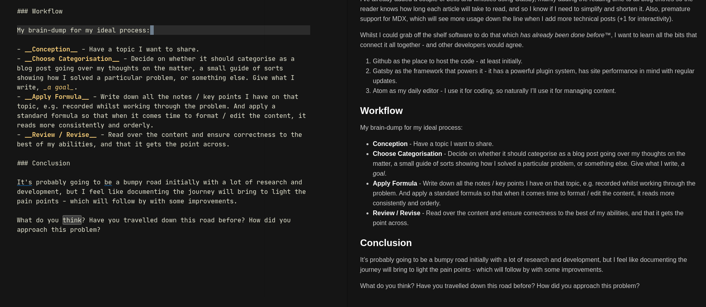

I enjoy reading. And as much as I wanted to write something, I never got around to it. With that said, this first post will dive straight into the thick of it.

### Thought Process

I want to write content that I believe would help future me, and also inspire and help others. And so, I will share my current work-in-progress journey, one purposed to involve little time in maintaining.

- Have topics I want to share.
- Pick a framework to lay out the content.
- In the future, ensure it empowers me to focus on the content and less on the internals.
- Allow for potential scaling, and build it out bit by bit.
- And last but probably the most important, I want to ensure a high level of readability later on, which means conciseness, structure and clear intent - unlike this first post.

### Reflection

For the reasons above, I chose to host the content and open source the code on GitHub ❤️, and use Gatsby as the framework that ties it all together. I plan to add GitHub actions to automatically deploy after pushing or merging changes.

I've already added a couple of bells and whistles using Gatsby, mainly adding the reading time to all blog entries so the reader knows how long each article will take to read, and so I know if I need to simplify and shorten it. Also, premature support for MDX, which will see more usage down the line when I add more technical posts (+1 for interactivity).

Whilst I could grab off-the-shelf software or services to do that which _has already been done before™️_, I want to learn all the bits that connect it all together - and other developers would probably agree.

1. Github as the place to host the code - at least initially.
2. Gatsby as the framework that powers it - it has a powerful plugin system, has site performance in mind with regular updates.
3. Atom as my daily editor - I use it for coding, so naturally I'll use it for managing content.

### Workflow

My brain-dump for my ideal process:

- __Conception__ - Have a topic I want to share.
- __Choose Categorisation__ - Decide on whether it should categorise as a blog post going over my thoughts on the matter, a small guide of sorts showing how I solved a particular problem, or something else. Give what I write, _a goal_.
- __Apply Formula__ - Write down all the notes / key points I have on that topic, e.g. recorded whilst working through the problem. And apply a standard formula so that when it comes time to format / edit the content, it reads more consistently and orderly.
- __Review / Revise__ - Read over the content and ensure correctness to the best of my abilities, and that it gets the point across.

### Conclusion

I foresee a bumpy road with a lot of research and development, but I will document the journey bring to light the pain points experienced. I feel happy with what I've managed to string together thus far.

What do you think? Have you travelled down this road before? How did you approach this problem? I guess by the time I've written this I haven't added comment support yet, but perhaps later on I would have.
